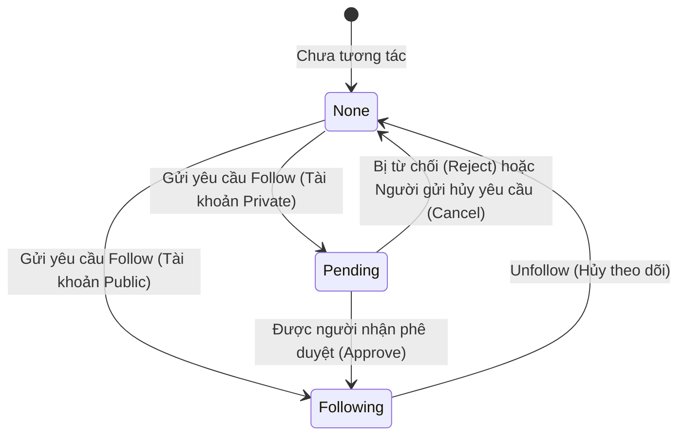

# CHƯƠNG 2: PHÂN TÍCH VÀ THIẾT KẾ HỆ THỐNG

Chương này trình bày chi tiết về quá trình phân tích và thiết kế hệ thống cho ứng dụng mạng xã hội (Instagram Clone). Nội dung bao gồm việc xác định các tác nhân (Actors), đặc tả các ca sử dụng (Use Cases) cốt lõi và thiết kế cơ sở dữ liệu vật lý kèm theo các phương án tối ưu hóa hiệu năng truy vấn thông qua hệ thống chỉ mục (Index).

---

## 2.1. DANH SÁCH CHI TIẾT CÁC TÁC NHÂN (ACTORS) VÀ VAI TRÒ
Hệ thống mạng xã hội tương tác thời gian thực này bao gồm cả tác nhân con người (Human Actors) và các tác nhân hệ thống tự động (System Actors):

### 2.1.1. Tác nhân Con người (Human Actors)
1. **Khách viếng thăm (Guest / Anonymous User)**:
   - *Mô tả*: Người dùng chưa thực hiện đăng nhập hoặc chưa đăng ký tài khoản.
   - *Vai trò*: Chỉ có quyền truy cập các nội dung công khai (Public Posts/Profiles), thực hiện các thao tác đăng nhập hoặc đăng ký tài khoản mới qua cổng định danh Keycloak.
2. **Thành viên mạng xã hội (Authenticated User)**:
   - *Mô tả*: Người dùng đã xác thực thành công qua Keycloak.
   - *Vai trò*: Thực hiện đầy đủ các chức năng tương tác như đăng bài viết (ảnh đơn/video/carousel), bày tỏ cảm xúc (LIKE/HEART/HAHA...), bình luận dạng cây, đăng story, xem story, gửi tin nhắn real-time, theo dõi (follow) người dùng khác dưới cả cơ chế Public và Private.
3. **Quản trị viên hệ thống (Administrator - Admin)**:
   - *Mô tả*: Người dùng có vai trò quản trị tối cao trong hệ thống.
   - *Vai trò*: Quản lý báo cáo vi phạm (Reports), duyệt nội dung, khóa/mở khóa tài khoản người dùng vi phạm tiêu chuẩn cộng đồng, cấu hình các tham số hệ thống.

### 2.1.2. Tác nhân Hệ thống (System / External Actors)
1. **Hệ thống định danh độc lập (Keycloak Identity Provider)**:
   - *Mô tả*: Hệ thống quản lý danh tính và quyền truy cập (IAM) mã nguồn mở.
   - *Vai trò*: Chịu trách nhiệm đăng ký, đăng nhập, cấp phát Access Token (JWT), lưu trữ thông tin tài khoản cốt lõi và gửi tín hiệu đồng bộ thông tin sang cơ sở dữ liệu chính của mạng xã hội khi có tài khoản mới hoặc cập nhật.
2. **Bộ lập lịch hệ thống (System Scheduler / Cron Service)**:
   - *Mô tả*: Tác nhân chạy ngầm (Background Job) được cấu hình định kỳ trong Spring Boot.
   - *Vai trò*: Tự động quét và dọn dẹp các story hết hạn (sau 24 giờ kể từ khi tạo mà không được đưa vào mục Highlights), thực hiện các tác vụ cập nhật denormalized counters (như đếm lại tần suất hashtag, thống kê lượt tương tác định kỳ để giảm tải cho DB chính).
3. **Dịch vụ lưu trữ đám mây (Cloud Media Storage - AWS S3 / Cloudinary)**:
   - *Mô tả*: Hệ thống lưu trữ các tập tin đa phương tiện bên ngoài.
   - *Vai trò*: Tiếp nhận, lưu giữ hình ảnh và video từ bài viết, tin nhắn, câu chuyện (stories). Hệ thống lưu trữ các URL truy cập và metadata của các file này vào database.
4. **Dịch vụ thông báo thời gian thực (Real-time Notification Service / WebSocket Broker)**:
   - *Mô tả*: Máy chủ WebSocket hỗ trợ giao thức STOMP.
   - *Vai trò*: Đẩy tin nhắn và thông báo tương tác tức thời (like, comment, follow request) tới người dùng đang trực tuyến.

---

## 2.2. ĐẶC TẢ CHI TIẾT CÁC CA SỬ DỤNG PHỨC TẠP (USE CASE DESCRIPTIONS)

### 2.2.1. Ca sử dụng 1: Đăng nhập và Đồng bộ tài khoản từ Keycloak (Login & Sync User)

```mermaid
sequenceDiagram
    actor User as Người dùng
    participant App as Ứng dụng (Web/Mobile)
    participant Keycloak as Keycloak Server
    participant BE as Spring Boot Backend
    database DB as MySQL Database

    User->>App: Yêu cầu Đăng nhập
    App->>Keycloak: Chuyển hướng tới Cổng đăng nhập Keycloak
    Keycloak->>User: Hiển thị Form Đăng nhập
    User->>Keycloak: Nhập Username & Password
    Keycloak->>Keycloak: Xác thực tài khoản
    Keycloak->>App: Trả về Authorization Code
    App->>BE: Gửi Authorization Code
    BE->>Keycloak: Đổi Code lấy JWT Access Token
    Keycloak->>BE: Trả về JWT Access Token (Chứa thông tin User)
    BE->>BE: Giải mã JWT, trích xuất Keycloak UUID, email, username
    BE->>DB: Kiểm tra xem User đã tồn tại trong DB chưa (theo id_user / keycloak_id)
    alt User chưa tồn tại (Đăng nhập lần đầu)
        BE->>DB: Thực hiện INSERT bản ghi mới (Đồng bộ thông tin: name, email, photo)
    else User đã tồn tại
        BE->>DB: Cập nhật thông tin mới nhất từ Keycloak (nếu có thay đổi)
    end
    BE->>App: Trả về JWT nội bộ & Thiết lập Session
    App->>User: Hiển thị giao diện Trang chủ đã Đăng nhập
```

* **Tên ca sử dụng**: Đăng nhập và Đồng bộ tài khoản từ Keycloak (UC-01).
* **Tác nhân chính**: Người dùng, Keycloak, Spring Boot Backend.
* **Mục tiêu**: Xác thực người dùng thông qua Keycloak và tự động đồng bộ thông tin tài khoản sang MySQL để phục vụ lưu trữ quan hệ dữ liệu trong mạng xã hội.
* **Tiền điều kiện**: Người dùng có tài khoản hợp lệ trên Keycloak.
* **Luồng sự kiện chính**:
  1. Người dùng nhấn nút "Đăng nhập" trên ứng dụng.
  2. Ứng dụng chuyển hướng người dùng đến giao diện đăng nhập của Keycloak.
  3. Người dùng nhập thông tin đăng nhập và xác thực thành công.
  4. Keycloak chuyển hướng về ứng dụng kèm Authorization Code.
  5. Backend nhận mã, gửi yêu cầu đến Keycloak để lấy JWT Access Token.
  6. Backend giải mã JWT để trích xuất `keycloak_id`, `email`, `username`, `firstname`, `lastname`.
  7. Backend thực hiện truy vấn cơ sở dữ liệu:
     - Nếu `keycloak_id` chưa tồn tại trong bảng `users`, thực hiện lưu mới người dùng này với ID được thiết lập bằng đúng UUID từ Keycloak. Trạng thái tài khoản ban đầu mặc định là Public.
     - Nếu `keycloak_id` đã tồn tại, thực hiện cập nhật các trường thông tin thay đổi (như `photo`, `name`).
  8. Hệ thống phản hồi đăng nhập thành công và trả về phiên làm việc cho người dùng.
* **Ngoại lệ**:
  - *Lỗi kết nối Keycloak*: Hệ thống báo lỗi "Không thể kết nối đến máy chủ định danh, vui lòng thử lại sau".
  - *Tài khoản bị khóa ở DB chính*: Nếu trong DB chính có cờ `deletion_date` không null, Backend từ chối đăng nhập dù Keycloak báo hợp lệ.

---

### 2.2.2. Ca sử dụng 2: Yêu cầu và Phê duyệt Follow tài khoản Private (Private Account Follow Flow)



* **Tên ca sử dụng**: Theo dõi tài khoản Private (UC-02).
* **Tác nhân chính**: Người theo dõi (Follower), Người được theo dõi (Target User).
* **Mục tiêu**: Quản lý mối quan hệ follow giữa hai người dùng khi người nhận kích hoạt chế độ tài khoản riêng tư (`isPrivate = true`).
* **Tiền điều kiện**: Cả hai tài khoản đều ở trạng thái hoạt động bình thường.
* **Luồng sự kiện chính**:
  1. Người theo dõi truy cập trang cá nhân của Target User và nhấn nút "Follow".
  2. Hệ thống kiểm tra thuộc tính `isPrivate` của Target User trong bảng `users`:
     - **Trường hợp Public (`isPrivate = false`)**: Hệ thống tự động tạo bản ghi trong bảng `followerships` với trạng thái `status = 'ACCEPTED'`. Mối quan hệ theo dõi có hiệu lực ngay lập tức.
     - **Trường hợp Private (`isPrivate = true`)**: Hệ thống tạo bản ghi trong bảng `followerships` với trạng thái `status = 'PENDING'`. Đồng thời gửi thông báo yêu cầu follow thời gian thực đến Target User qua WebSocket.
  3. Target User nhận được yêu cầu phê duyệt trong phần thông báo.
  4. Target User nhấn "Đồng ý" (Approve) hoặc "Từ chối" (Reject):
     - *Nếu Đồng ý*: Trạng thái bản ghi `followerships` được cập nhật từ `PENDING` thành `ACCEPTED`.
     - *Nếu Từ chối*: Bản ghi `followerships` bị xóa hoàn toàn khỏi cơ sở dữ liệu (`orphanRemoval = true`).
* **Ngoại lệ**:
  - *Tự follow chính mình*: Hệ thống chặn và báo lỗi nghiệp vụ ở mức API.
  - *Yêu cầu trùng lặp*: Đã có yêu cầu đang ở trạng thái `PENDING` hoặc `ACCEPTED`, hệ thống từ chối tạo mới.

---

### 2.2.3. Ca sử dụng 3: Đăng bài viết kèm bóc tách tự động Hashtag và Mention (Post & Parse Flow)

* **Tên ca sử dụng**: Tạo bài viết mới kèm phân tích từ khóa tương tác (UC-03).
* **Tác nhân chính**: Thành viên mạng xã hội.
* **Mục tiêu**: Lưu trữ bài viết đa phương tiện, tự động bóc tách các hashtag (`#`) và tag tên người dùng (`@`) trong nội dung văn bản để lập chỉ mục tìm kiếm và liên kết dữ liệu.
* **Luồng sự kiện chính**:
  1. Người dùng soạn nội dung bài viết, đính kèm danh sách file ảnh/video và nhấn "Đăng bài".
  2. Hệ thống lưu trữ các tệp phương tiện lên S3/Cloudinary và nhận về danh sách URLs kèm metadata (kích thước, định dạng).
  3. Hệ thống tạo một transaction trong Spring Boot:
     - Tạo bản ghi bài đăng trong bảng `posts`.
     - Lưu danh sách file phương tiện vào bảng `post_media` kèm trường `display_order` tương ứng để giữ đúng thứ tự hiển thị của dạng ảnh Carousel.
  4. Bộ lọc biểu thức chính quy (Regex Pattern Parser) tiến hành phân tích chuỗi `text` của bài viết:
     - **Nhận diện Hashtags (`#\w+`)**: Với mỗi từ khóa tìm thấy (ví dụ: `#travel` -> từ khóa `"travel"`), hệ thống kiểm tra bảng `hashtags`. Nếu chưa có, tạo mới hashtag với `post_count = 1`. Nếu đã tồn tại, tăng `post_count` lên 1 đơn vị. Đồng thời thêm bản ghi liên kết vào bảng trung gian `post_hashtags`.
     - **Nhận diện Mentions (`@\w+`)**: Với mỗi username tìm thấy (ví dụ: `@nguyena`), hệ thống tìm kiếm trong bảng `users`. Nếu khớp, thêm bản ghi vào bảng trung gian `post_user_tags` (tọa độ `x_position` và `y_position` được đặt mặc định là null vì đây là tag trong caption, khác với tag trực tiếp trên ảnh). Đồng thời bắn thông báo real-time tới người được tag.
  5. Kết thúc transaction, trả về kết quả đăng bài thành công cho người dùng.

---

### 2.2.4. Ca sử dụng 4: Truy vấn Cây bình luận đệ quy đa cấp (Recursive Tree Comment Querying)

* **Tên ca sử dụng**: Tải cây bình luận đa cấp (UC-04).
* **Tác nhân chính**: Hệ thống Backend, Người dùng xem bài viết.
* **Mục tiêu**: Lấy toàn bộ bình luận của một bài đăng sắp xếp theo quan hệ phân cấp Cha-Con (Bình luận gốc và các bình luận phản hồi đệ quy ở cấp dưới).
* **Giải pháp kỹ thuật (Self-referencing Tree)**:
  - Bảng `comments` lưu trữ trường `parent_comment_id` liên kết ngoại đến chính cột `id_comment` của cùng bảng. Nếu `parent_comment_id IS NULL`, đó là bình luận gốc (Root Comment). Ngược lại, đó là bình luận phản hồi (Reply).
* **Luồng sự kiện chính**:
  1. Người dùng nhấn nút xem chi tiết bài đăng hoặc tải bình luận.
  2. Ứng dụng gửi yêu cầu lấy bình luận của bài đăng: `GET /api/posts/{postId}/comments`.
  3. Backend thực hiện truy vấn bằng JPA / Custom SQL. Để tối ưu hóa hiệu năng, tránh lỗi N+1 Query và đệ quy vô hạn trong bộ nhớ JVM:
     - **Phương án 1 (Truy vấn phẳng kèm dựng cây ở bộ nhớ)**: Backend lấy toàn bộ danh sách bình luận của bài viết trong một câu truy vấn duy nhất: `SELECT * FROM comments WHERE id_post = :postId ORDER BY create_time ASC`. Sau đó dùng thuật toán dựng cây bằng Map trong Java (tuyệt đối không chạy vòng lặp truy vấn SQL lặp đi lặp lại).
     - **Phương án 2 (CTE đệ quy - Recursive CTE)**: Nếu cần phân trang bình luận gốc và chỉ tải trước tối đa 2 cấp reply để tối ưu UI:
       ```sql
       WITH RECURSIVE CommentTree AS (
           SELECT *, 1 AS depth FROM comments 
           WHERE id_post = :postId AND parent_comment_id IS NULL
           UNION ALL
           SELECT c.*, ct.depth + 1 FROM comments c
           INNER JOIN CommentTree ct ON c.parent_comment_id = ct.id_comment
       )
       SELECT * FROM CommentTree WHERE depth <= 3;
       ```
  4. Hệ thống chuyển đổi dữ liệu thành cấu trúc JSON phân cấp dạng cây (Tree DTO) và trả về Client để hiển thị.

---

## 2.3. ĐẶC TẢ CẤU TRÚC CƠ SỞ DỮ LIỆU LOGIC (LOGICAL DATABASE SCHEMA)

Dưới đây là cấu trúc chi tiết của các bảng trong cơ sở dữ liệu MySQL 8.0, tương ứng với các Java Entity trong hệ thống mạng xã hội Spring Boot.

### 2.3.1. Bảng `users` (Quản lý người dùng)
* **Khóa chính**: `id_user` (VARCHAR(36)) - Đồng bộ trực tiếp UUID từ Keycloak.

| Tên cột | Kiểu dữ liệu (MySQL) | Ràng buộc | Mô tả |
| :--- | :--- | :--- | :--- |
| `id_user` | VARCHAR(36) | PRIMARY KEY | ID định danh duy nhất (UUID từ Keycloak) |
| `username` | VARCHAR(100) | UNIQUE, NOT NULL | Tên tài khoản độc nhất |
| `email` | VARCHAR(100) | UNIQUE, NOT NULL | Địa chỉ thư điện tử |
| `name` | VARCHAR(100) | NOT NULL | Tên hiển thị đầy đủ |
| `keycloak_id` | VARCHAR(100) | UNIQUE, NOT NULL | ID đồng bộ từ hệ thống Keycloak |
| `firstname` | VARCHAR(100) | NOT NULL | Tên |
| `lastname` | VARCHAR(100) | NOT NULL | Họ |
| `surname` | VARCHAR(100) | NOT NULL | Tên đệm |
| `photo` | VARCHAR(2048) | NULL | URL ảnh đại diện |
| `description`| VARCHAR(2000) | NULL | Tiểu sử / Giới thiệu bản thân |
| `creation_date`| DATETIME | NOT NULL | Thời điểm tạo tài khoản |
| `deletion_date`| DATETIME | NULL | Thời điểm xóa tài khoản (nếu soft-delete) |
| `is_checked` | BOOLEAN | DEFAULT FALSE | Đánh dấu tài khoản chính chủ (tích xanh) |
| `is_private` | BOOLEAN | DEFAULT FALSE | Chế độ riêng tư: 0 = Public, 1 = Private |
| `id_status` | VARCHAR(36) | FOREIGN KEY | Liên kết tới bảng `status` |

* **Thiết kế Chỉ mục (INDEX)**:
  * `INDEX idx_users_username (username)`: Phục vụ tính năng tìm kiếm trang cá nhân và tự động gợi ý lúc tag người dùng (`@mention`).
  * `INDEX idx_users_email (email)`: Tối ưu hóa truy vấn đăng nhập/xác thực tài khoản.

---

### 2.3.2. Bảng `posts` (Bài viết)
* **Khóa chính**: `id_post` (VARCHAR(36))

| Tên cột | Kiểu dữ liệu (MySQL) | Ràng buộc | Mô tả |
| :--- | :--- | :--- | :--- |
| `id_post` | VARCHAR(36) | PRIMARY KEY | ID định danh bài viết |
| `text` | TEXT | NULL | Nội dung bài viết (Caption) |
| `post_type` | VARCHAR(20) | NOT NULL | Phân loại: IMAGE, VIDEO, CAROUSEL, TEXT |
| `visibility` | VARCHAR(20) | NOT NULL | Quyền riêng tư: PUBLIC, FOLLOWERS, PRIVATE |
| `create_time` | DATETIME | NOT NULL | Thời gian đăng bài |
| `is_pinned` | BOOLEAN | DEFAULT FALSE | Ghim bài viết lên đầu trang cá nhân |
| `id_user` | VARCHAR(36) | FOREIGN KEY (users) | ID chủ bài viết |

* **Thiết kế Chỉ mục (INDEX)**:
  * `INDEX idx_posts_user_time (id_user, create_time DESC)`: Tối ưu hóa việc tải danh sách bài viết trên trang cá nhân của một người dùng cụ thể theo thứ tự mới nhất.
  * `INDEX idx_posts_create_time (create_time DESC)`: Dùng cho trang Khám phá (Explore/Feed) để sắp xếp bài đăng.

---

### 2.3.3. Bảng `post_media` (Tập tin phương tiện bài viết)
* **Khóa chính**: `id_media` (VARCHAR(36))
* **Ràng buộc duy nhất**: `UNIQUE KEY uq_post_media_order (id_post, display_order)` - Đảm bảo trong một bài viết không có hai phương tiện trùng thứ tự hiển thị.

| Tên cột | Kiểu dữ liệu (MySQL) | Ràng buộc | Mô tả |
| :--- | :--- | :--- | :--- |
| `id_media` | VARCHAR(36) | PRIMARY KEY | ID đa phương tiện |
| `id_post` | VARCHAR(36) | FOREIGN KEY (posts) | Thuộc bài viết nào |
| `media_url` | VARCHAR(2048) | NOT NULL | URL lưu trữ file |
| `media_type` | VARCHAR(10) | NOT NULL | Định dạng: IMAGE hoặc VIDEO |
| `display_order`| INT | NOT NULL | Thứ tự hiển thị (0, 1, 2...) trong Carousel |
| `width` | INT | NULL | Chiều rộng của ảnh/video |
| `height` | INT | NULL | Chiều cao của ảnh/video |
| `duration_sec` | INT | NULL | Thời lượng video (giây) |

* **Thiết kế Chỉ mục (INDEX)**:
  * `INDEX idx_media_post (id_post)`: Lấy nhanh toàn bộ file ảnh/video của bài viết khi hiển thị.

---

### 2.3.4. Bảng `followerships` (Mối quan hệ theo dõi)
* **Khóa chính**: `id_followership` (VARCHAR(36))
* **Ràng buộc duy nhất**: `UNIQUE KEY uq_follow_pair (id_user_checked, id_user_follower)`

| Tên cột | Kiểu dữ liệu (MySQL) | Ràng buộc | Mô tả |
| :--- | :--- | :--- | :--- |
| `id_followership`| VARCHAR(36) | PRIMARY KEY | ID định danh |
| `id_user_checked` | VARCHAR(36) | FOREIGN KEY (users) | Người được theo dõi |
| `id_user_follower`| VARCHAR(36) | FOREIGN KEY (users) | Người nhấn theo dõi |
| `status` | VARCHAR(10) | NOT NULL | Trạng thái: PENDING hoặc ACCEPTED |
| `create_time` | DATETIME | NOT NULL | Thời gian tạo mối quan hệ |

* **Thiết kế Chỉ mục (INDEX)**:
  * `INDEX idx_follow_follower (id_user_follower, status)`: Tối ưu hóa truy vấn danh sách "Đang theo dõi" (Following list) của một user.
  * `INDEX idx_follow_target (id_user_checked, status)`: Tối ưu hóa truy vấn danh sách "Người theo dõi" (Followers list) của một user.

---

### 2.3.5. Bảng `hashtags` và `post_hashtags` (Quản lý từ khóa Hashtag)
#### Bảng `hashtags`
* **Khóa chính**: `id_hashtag` (VARCHAR(36))

| Tên cột | Kiểu dữ liệu (MySQL) | Ràng buộc | Mô tả |
| :--- | :--- | :--- | :--- |
| `id_hashtag` | VARCHAR(36) | PRIMARY KEY | ID hashtag |
| `name` | VARCHAR(100) | UNIQUE, NOT NULL | Tên từ khóa không dấu '#' |
| `post_count` | INT | DEFAULT 0 | Tổng số bài viết gắn tag này |
| `created_at` | DATETIME | NOT NULL | Ngày khởi tạo hashtag |

#### Bảng `post_hashtags` (Bảng trung gian M:N)
* **Khóa chính**: Composite PK (`id_post`, `id_hashtag`)

| Tên cột | Kiểu dữ liệu (MySQL) | Ràng buộc | Mô tả |
| :--- | :--- | :--- | :--- |
| `id_post` | VARCHAR(36) | FOREIGN KEY (posts) | Liên kết bài viết |
| `id_hashtag` | VARCHAR(36) | FOREIGN KEY (hashtags) | Liên kết hashtag |

* **Thiết kế Chỉ mục (INDEX)**:
  * `INDEX idx_post_hashtags_tag (id_hashtag)`: Tìm kiếm tất cả bài viết chứa một hashtag cụ thể nhanh hơn khi người dùng click vào hashtag.

---

### 2.3.6. Bảng `post_user_tags` (Nhắc tên - Mentions trong bài đăng)
* **Khóa chính**: Composite PK (`id_post`, `id_user`)

| Tên cột | Kiểu dữ liệu (MySQL) | Ràng buộc | Mô tả |
| :--- | :--- | :--- | :--- |
| `id_post` | VARCHAR(36) | FOREIGN KEY (posts) | Bài viết chứa thẻ nhắc tên |
| `id_user` | VARCHAR(36) | FOREIGN KEY (users) | Người được nhắc tên |
| `x_position` | DECIMAL(5,2) | NULL | Tọa độ X (%) của thẻ trên ảnh |
| `y_position` | DECIMAL(5,2) | NULL | Tọa độ Y (%) của thẻ trên ảnh |

* **Thiết kế Chỉ mục (INDEX)**:
  * `INDEX idx_user_tags_user (id_user)`: Tìm kiếm tất cả bài viết mà người dùng này được tag tên vào.

---

### 2.3.7. Bảng `likes` (Bày tỏ cảm xúc đa dạng)
* **Khóa chính**: `id_like` (VARCHAR(36))
* **Ràng buộc duy nhất**: `UNIQUE KEY uq_like_user_target (id_user, target_type, target_id)` - Đảm bảo một user chỉ bày tỏ duy nhất 1 loại cảm xúc trên 1 thực thể (Post/Comment) tại một thời điểm.

| Tên cột | Kiểu dữ liệu (MySQL) | Ràng buộc | Mô tả |
| :--- | :--- | :--- | :--- |
| `id_like` | VARCHAR(36) | PRIMARY KEY | ID lượt thích |
| `target_type` | VARCHAR(10) | NOT NULL | Đối tượng: POST hoặc COMMENT |
| `target_id` | VARCHAR(36) | NOT NULL | ID của bài đăng hoặc bình luận |
| `id_user` | VARCHAR(36) | FOREIGN KEY (users) | Người thực hiện |
| `reaction_type`| VARCHAR(10) | NOT NULL | Cảm xúc: LIKE, HEART, HAHA, WOW, SAD, ANGRY |
| `create_time` | DATETIME | NOT NULL | Thời điểm bày tỏ cảm xúc |

* **Thiết kế Chỉ mục (INDEX)**:
  * `INDEX idx_likes_target (target_type, target_id)`: Đếm số lượng tương tác hoặc liệt kê danh sách tương tác của một Post/Comment.

---

### 2.3.8. Bảng `comments` (Bình luận phân cấp dạng cây)
* **Khóa chính**: `id_comment` (VARCHAR(36))

| Tên cột | Kiểu dữ liệu (MySQL) | Ràng buộc | Mô tả |
| :--- | :--- | :--- | :--- |
| `id_comment` | VARCHAR(36) | PRIMARY KEY | ID bình luận |
| `text` | VARCHAR(2000) | NOT NULL | Nội dung bình luận |
| `create_time` | DATETIME | NOT NULL | Thời gian gửi bình luận |
| `id_user` | VARCHAR(36) | FOREIGN KEY (users) | Người bình luận |
| `id_post` | VARCHAR(36) | FOREIGN KEY (posts) | Thuộc bài viết nào |
| `parent_comment_id`| VARCHAR(36) | FOREIGN KEY (comments) | ID bình luận cha (Null nếu là comment gốc) |

* **Thiết kế Chỉ mục (INDEX)**:
  * `INDEX idx_comments_post (id_post, parent_comment_id)`: Tải nhanh các bình luận cấp cha của một bài viết.
  * `INDEX idx_comments_parent (parent_comment_id)`: Tìm tất cả các phản hồi (Replies) của bình luận cha.

---

### 2.3.9. Bảng `conversations` (Cuộc trò chuyện)
* **Khóa chính**: `id_conversation` (VARCHAR(36))

| Tên cột | Kiểu dữ liệu (MySQL) | Ràng buộc | Mô tả |
| :--- | :--- | :--- | :--- |
| `id_conversation`| VARCHAR(36) | PRIMARY KEY | ID cuộc trò chuyện |
| `name` | VARCHAR(255) | NULL | Tên nhóm chat (Null nếu là chat 1-1) |
| `type` | VARCHAR(50) | NOT NULL | Kiểu trò chuyện: SINGLE hoặc GROUP |
| `create_time` | DATETIME | NOT NULL | Ngày tạo |
| `last_message_time`| DATETIME | NOT NULL | Thời điểm tin nhắn cuối cùng (để sort Inbox) |

* **Thiết kế Chỉ mục (INDEX)**:
  * `INDEX idx_conversation_last_msg (last_message_time DESC)`: Tải danh sách inbox xếp từ mới nhất đến cũ nhất.

---

### 2.3.10. Bảng `participants` (Thành viên cuộc trò chuyện)
* **Khóa chính**: `id_participant` (VARCHAR(36))

| Tên cột | Kiểu dữ liệu (MySQL) | Ràng buộc | Mô tả |
| :--- | :--- | :--- | :--- |
| `id_participant`| VARCHAR(36) | PRIMARY KEY | ID thành viên tham gia |
| `id_conversation`| VARCHAR(36) | FOREIGN KEY (conversations)| Liên kết cuộc trò chuyện |
| `id_user` | VARCHAR(36) | FOREIGN KEY (users) | Liên kết người dùng |
| `last_read_message_id`| VARCHAR(36) | NULL | ID tin nhắn cuối cùng đã đọc |
| `joined_time` | DATETIME | NOT NULL | Thời điểm tham gia cuộc trò chuyện |

* **Thiết kế Chỉ mục (INDEX)**:
  * `INDEX idx_participants_user (id_user)`: Tìm kiếm toàn bộ các phòng chat mà người dùng đang tham gia để nạp vào danh sách Inbox.

---

### 2.3.11. Bảng `messages` (Tin nhắn thời gian thực)
* **Khóa chính**: `id_message` (VARCHAR(36))

| Tên cột | Kiểu dữ liệu (MySQL) | Ràng buộc | Mô tả |
| :--- | :--- | :--- | :--- |
| `id_message` | VARCHAR(36) | PRIMARY KEY | ID tin nhắn |
| `id_conversation`| VARCHAR(36) | FOREIGN KEY (conversations)| Trò chuyện chứa tin nhắn này |
| `id_user_transmitter`| VARCHAR(36) | FOREIGN KEY (users) | Người gửi tin |
| `text` | VARCHAR(3000) | NULL | Nội dung chữ |
| `photo` | VARCHAR(2048) | NULL | Link đính kèm hình ảnh/video |
| `id_shared_post` | VARCHAR(36) | FOREIGN KEY (posts) | ID bài viết được chia sẻ qua chat |
| `message_type` | VARCHAR(15) | NOT NULL | Định dạng: TEXT, IMAGE, VIDEO, SHARED_POST, SYSTEM |
| `create_time` | DATETIME | NOT NULL | Thời gian gửi |

* **Thiết kế Chỉ mục (INDEX)**:
  * `INDEX idx_messages_conversation (id_conversation, create_time DESC)`: Truy vấn danh sách tin nhắn cũ hơn (phân trang vô hạn cuộn ngược - infinite scroll chat logs).

---

### 2.3.12. Bảng `stories` và `story_views` (Khoảnh khắc 24 giờ)
#### Bảng `stories`
* **Khóa chính**: `id_story` (VARCHAR(36))

| Tên cột | Kiểu dữ liệu (MySQL) | Ràng buộc | Mô tả |
| :--- | :--- | :--- | :--- |
| `id_story` | VARCHAR(36) | PRIMARY KEY | ID story |
| `id_user` | VARCHAR(36) | FOREIGN KEY (users) | Tác giả |
| `media_url` | VARCHAR(2048) | NOT NULL | URL ảnh/video của story |
| `media_type` | VARCHAR(10) | NOT NULL | Thể loại: IMAGE hoặc VIDEO |
| `caption` | VARCHAR(2200) | NULL | Nội dung đi kèm |
| `created_at` | DATETIME | NOT NULL | Ngày đăng |
| `expires_at` | DATETIME | NOT NULL | Ngày hết hạn tự động (thường = created_at + 24h) |
| `is_archived` | BOOLEAN | DEFAULT FALSE | Được lưu trữ vĩnh viễn trong Highlights |
| `metadata` | JSON | NULL | Lưu trữ vị trí sticker, nhạc nền, text overlay |

* **Thiết kế Chỉ mục (INDEX)**:
  * `INDEX idx_stories_active (expires_at, id_user)`: Tìm nhanh các story chưa hết hạn để hiển thị trên thanh đầu trang của bảng tin.

#### Bảng `story_views` (Lưu vết lượt xem story)
* **Khóa chính**: Composite PK (`id_story`, `id_user`)

| Tên cột | Kiểu dữ liệu (MySQL) | Ràng buộc | Mô tả |
| :--- | :--- | :--- | :--- |
| `id_story` | VARCHAR(36) | FOREIGN KEY (stories) | Story được xem |
| `id_user` | VARCHAR(36) | FOREIGN KEY (users) | Khán giả xem story |
| `viewed_at` | DATETIME | NOT NULL | Thời gian xem |
